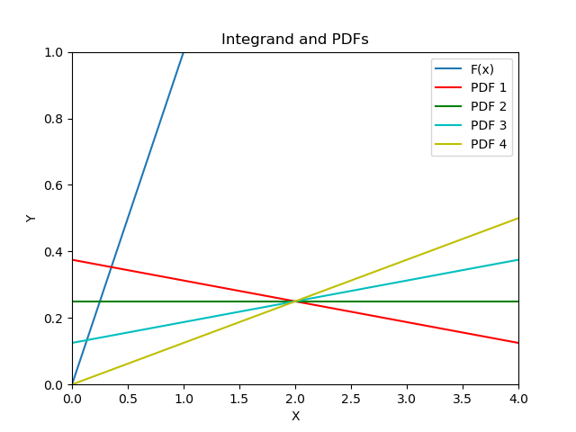
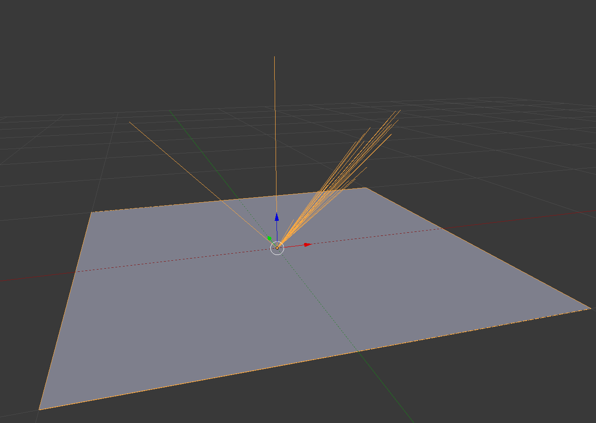
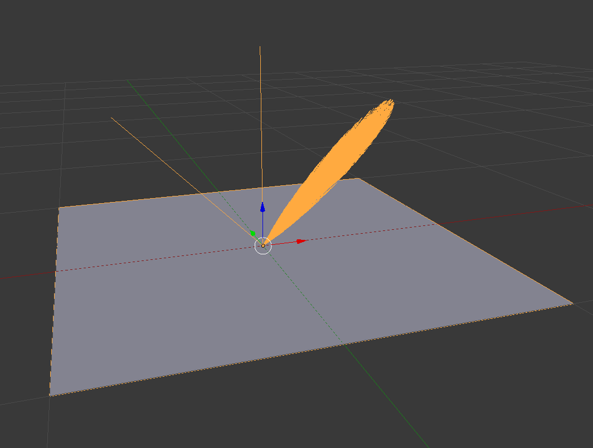
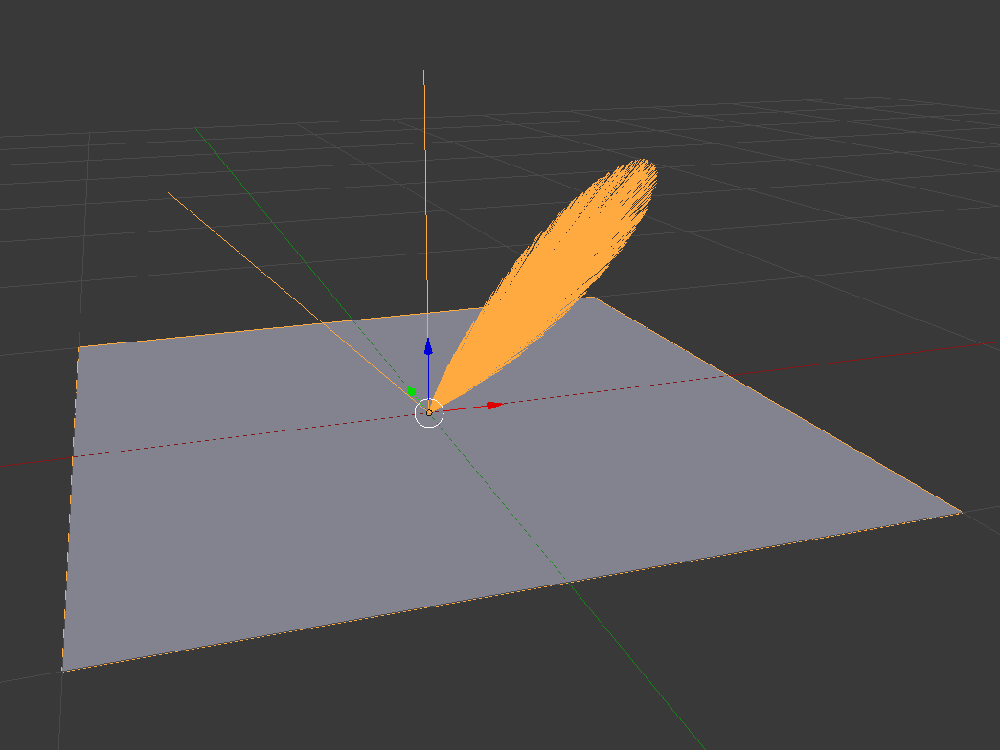

# 5608 HW3 Writeup

## Part 1

Graph of the integrand and 4 pdf functions (generated by part1/part1.py):


Required number of samples to get within 0.008 error (generated by part1/part1.py):
```
sampling function 1: required samples =  889064
sampling function 2: required samples =  333212
sampling function 3: required samples =  98672
sampling function 4: required samples =  1
```

Since the samples are generated randomly, these numbers will vary slightly from run to run.

# Part 2

Generate part2/part.obj using part2/part2.py.

Results:
Phong exponent = 75, numSamples = 25:


Phong exponent = 75, numSamples = 1000:


Phong exponent = 30, numSamples = 1000:


Phong exponent = 75, numSamples = 100 (before converting importance sampled vectors to world space):
