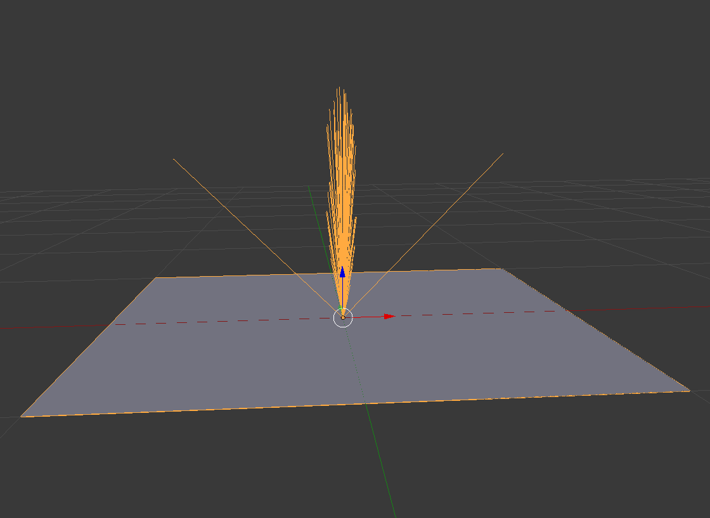

# 5608 HW3 Writeup

## Part 1

Graph of the integrand and 4 pdf functions (generated by part1/part1.py):


Required number of samples to get within 0.008 error (generated by part1/part1.py):
```
sampling function 1: required samples =  889064
sampling function 2: required samples =  333212
sampling function 3: required samples =  98672
sampling function 4: required samples =  1
```

Since the samples are generated randomly, these numbers will vary slightly from run to run.

## Part 2

Generate part2/part.obj using part2/part2.py.

Results:
Phong exponent = 75, numSamples = 25:


Phong exponent = 75, numSamples = 1000:


Phong exponent = 30, numSamples = 1000:


Phong exponent = 75, numSamples = 100 (before converting importance sampled vectors to world space):


## Part 3

### Sampling and Variance

Results of rendering occluder.pbrt with 1 - 64 samples and lowdiscrepency vs random sampling:


##### Questions
1: With Monte Carlo sampling, the error is O(1/sqrt(N)), so the variance is O(1/N). This means with if you double the number of samples, the MSE should be half. The Monte Carlo ('random') results above decrease on average by 50.3%, so this matches the expected result pretty well. 

2: The low-discrepancy sampler definitely performs better. It increasingly outperforms the random sampler as the number of samples are increased, with low-discrepancy being 1.14x lower with 1 sample, 7.9x lower with 8 samples, and eventually 29.2x lower with 64 samples. Low-discrepancy sampling has a lower variance because it ensures that the whole domain of the brdf is sampled. With Monte Carlo, it is purely random, so any given section of the brdf could be over-sampled or under-sampled, making the variance higher. Low-discrepancy is also commonly called "quasirandom" and in practice has an error convergence rate of O(1/N) while pure Monte Carlo is O(1/sqrt(N))


### Efficiency

Results ('spp' = samples per pixel):


##### Questions
1:
For the 'manykilleroos' scene, it seems like the most efficient combination would be 8 samples per pixel and 8 samples per light. Its variance is very close to the best runs, while its rendering time is somewhere in the middle, at a little over 1 second. Visually checking the images, it is hard to tell the difference too.
For the 'occluder' scene, this one is a little weird. It is the only scene where the variance does not strictly decrease as the samples per light increases. That being said, 32 samples per pixel with 4 samples per light has a better variance than roughly 80% of the other combinations, and only taking just over 1 second.
For the 'occluder_shadow' scene, I would say that the best combination would roughly be 8 samples per pixel and 32 samples per light. While it has a slightly higher render time at 2.8 seconds, it seems to reduce the most variance per second according to the graphs above.

2: No, it is not the same for every scene. What makes a lot of difference is how noticeable the shadows are. In the occluder_shadow scene, having a high number of light/shadow samples helps a lot because most of the scene is one big shadow. For the manykilleroos and regular occluder though, there are other objects and varying brightness values, where having a higher spp in general helps more. In general having less than 4 spp is always bad. There is just too much aliasing, even for very simply shaded scenes, so there will always be a somewhat high variance. It is also in general bad to always make the samples per light very high. The graphs above show that after some point, the gains you make from increasing that sampling number is very small, while the impact on rendering time is long.

3: A scene with many shadows will generally benefit the most from having a high number of light samples. If the light samples are low for those scenes, the variance in the soft shadows will be very noticeable. Scenes with only a few shadows, but lots of varying geometry and lights will not notice much change with higher light samples. Instead to help the variance in the lit regions and the aliasing on edges, they need a higher spp. 